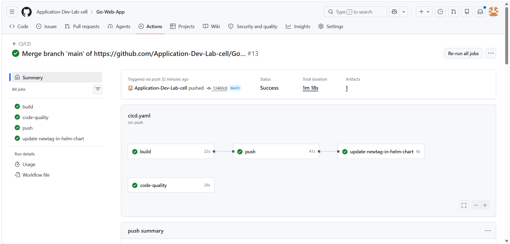

# 🚀 Go Web Application

[](https://go.dev/)
[](https://www.docker.com/)
[](https://kubernetes.io/)
[](https://helm.sh/)
[](LICENSE)

A modern, production-ready web application built with Go featuring complete DevOps implementation with **Docker**, **Kubernetes**, **Helm**, and **AWS EKS**.

---

## 📋 Table of Contents

- [Features](#-features)
- [Tech Stack](#-tech-stack)
- [Architecture](#-architecture)
- [Prerequisites](#-prerequisites)
- [Quick Start](#-quick-start)
- [Installation](#-installation)
- [Usage](#-usage)
- [Deployment](#-deployment)
- [Project Structure](#-project-structure)
- [Contributing](#-contributing)
- [License](#-license)

---

## ✨ Features

- ✅ **Lightweight & Fast** - Built with Go's `net/http` package
- ✅ **Multi-page Website** - Home, Courses, About, and Contact pages
- ✅ **Containerized** - Docker support for consistent environments
- ✅ **Orchestrated** - Kubernetes deployment ready
- ✅ **Infrastructure as Code** - Helm charts for easy deployment
- ✅ **Cloud Native** - AWS EKS integration
- ✅ **Load Balanced** - Ingress configuration included
- ✅ **Scalable** - Auto-scaling ready

---

## 🛠️ Tech Stack

| Component | Technology |
|-----------|-----------|
| **Backend** | Go (Golang) |
| **Containerization** | Docker |
| **Orchestration** | Kubernetes |
| **Package Manager** | Helm |
| **Cloud Platform** | AWS EKS |
| **Infrastructure** | Terraform/CloudFormation |

---

## 🏗️ Architecture

```
┌─────────────────────────────────────────┐
│         Internet / Load Balancer        │
└────────────────┬────────────────────────┘
                 │
     ┌───────────┼───────────┐
     │           │           │
┌────▼────┐ ┌────▼────┐ ┌────▼────┐
│  Pod 1  │ │  Pod 2  │ │  Pod 3  │
│ Go App  │ │ Go App  │ │ Go App  │
└────┬────┘ └────┬────┘ └────┬────┘
     └───────────┼───────────┘
         Kubernetes Service
         (Port 8080)
```

---

## 📦 Prerequisites

### Local Development
- **Go** 1.21+ - [Download](https://go.dev/dl/)
- **Git** - [Download](https://git-scm.com/download/win)
- **VS Code** - [Download](https://code.visualstudio.com/)

### Docker & Kubernetes
- **Docker Desktop** - [Download](https://www.docker.com/products/docker-desktop)
- **kubectl** - [Install Guide](https://kubernetes.io/docs/tasks/tools/install-kubectl-windows/)
- **eksctl** - [Install Guide](https://eksctl.io/installation/)
- **Helm** - [Install Guide](https://helm.sh/docs/intro/install/)

### AWS Integration
- **AWS CLI** - [Download](https://awscli.amazonaws.com/AWSCLIV2.msi)
- **AWS Account** with appropriate IAM permissions

---

## 🚀 Quick Start

### 1️⃣ Clone the Repository

```bash
git clone https://github.com/Application-Dev-Lab-cell/go-web-app.git
cd go-web-app
```

### 2️⃣ Run Locally

```bash
go run main.go
```

Access the application at: **http://localhost:8080**

Available routes:
- `/` - Home page
- `/courses` - Courses page
- `/about` - About page
- `/contact` - Contact page

---

## 📥 Installation

### Option A: Local Setup

```bash
# Install dependencies
go mod download

# Run tests
go test -v

# Build the application
go build -o main .

# Run the binary
./main
```

### Option B: Docker

```bash
# Build the Docker image
docker build -t go-web-app:latest .

# Run the container
docker run --rm -p 8080:8080 go-web-app:latest

# Access at http://localhost:8080
```

### Option C: Kubernetes (Local)

```bash
# Build and push image
docker build -t <your-registry>/go-web-app:v1.0 .
docker push <your-registry>/go-web-app:v1.0

# Update image in deployment.yaml
# Then apply manifests
kubectl apply -f k8s/manifests/deployment.yaml
kubectl apply -f k8s/manifests/service.yaml
kubectl apply -f k8s/manifests/ingress.yaml

# Verify deployment
kubectl get pods
kubectl get svc
```

---

## 💻 Usage

### Local Development

```bash
# Run the application
go run main.go

# Run with verbose output
go run main.go -v

# Run tests
go test ./... -v

# Run specific test
go test -run TestHandler -v
```

### View Application

Open your browser and navigate to:
```
http://localhost:8080/courses
```

---

## 🌐 Deployment

### AWS EKS Setup

#### Step 1: Configure AWS Credentials

```powershell
# Install AWS CLI
# Download: https://awscli.amazonaws.com/AWSCLIV2.msi

# Configure credentials
aws configure
# Enter AWS Access Key ID
# Enter AWS Secret Access Key
# Enter default region (e.g., us-east-1)
# Enter default output format (json)
```

#### Step 2: Create EKS Cluster

```powershell
# Create cluster using eksctl
eksctl create cluster --config-file cluster.yaml

# Verify cluster creation
kubectl get nodes
```

#### Step 3: Deploy with kubectl

```powershell
# Apply Kubernetes manifests
kubectl apply -f k8s/manifests/deployment.yaml
kubectl apply -f k8s/manifests/service.yaml
kubectl apply -f k8s/manifests/ingress.yaml

# Check deployment status
kubectl get deployments
kubectl get pods
kubectl get svc
kubectl get ingress
```

#### Step 4: Deploy with Helm (Recommended)

```powershell
# Install the Helm chart
helm install go-web-app ./helm/go-web-app-chart

# Verify installation
helm list
kubectl get pods

# Update deployment
helm upgrade go-web-app ./helm/go-web-app-chart

# Uninstall if needed
helm uninstall go-web-app
```

### Verify Deployment

```powershell
# Get service details
kubectl get svc go-web-app

# Get ingress details
kubectl get ingress

# View logs
kubectl logs -f deployment/go-web-app

# Port forward for local access
kubectl port-forward svc/go-web-app 8080:8080
```

---

## 📁 Project Structure

```
go-web-app/
├── main.go                 # Application entry point
├── main_test.go           # Unit tests
├── go.mod                 # Go module definition
├── Dockerfile             # Docker build instructions
├── cluster.yaml           # EKS cluster configuration
├── README.md             # This file
├── LICENSE               # MIT License
├── static/               # Static files
│   ├── home.html        # Home page
│   ├── courses.html     # Courses page
│   ├── about.html       # About page
│   ├── contact.html     # Contact page
│   └── images/          # Image assets
├── k8s/                 # Kubernetes manifests
│   └── manifests/
│       ├── deployment.yaml
│       ├── service.yaml
│       └── ingress.yaml
└── helm/                # Helm charts
    └── go-web-app-chart/
        ├── Chart.yaml
        ├── values.yaml
        └── templates/
            ├── deployment.yaml
            ├── service.yaml
            └── ingress.yaml
```

---

## 🧪 Testing

Run the test suite:

```bash
go test -v
go test -cover
go test -race
```

---

## 🤝 Contributing

Contributions are welcome! Please follow these steps:

1. **Fork** the repository
2. **Create** a feature branch (`git checkout -b feature/amazing-feature`)
3. **Commit** your changes (`git commit -m 'Add amazing feature'`)
4. **Push** to the branch (`git push origin feature/amazing-feature`)
5. **Open** a Pull Request

---

## 📝 License

This project is licensed under the **MIT License** - see the [LICENSE](LICENSE) file for details.

---

## 👤 Author

**Nikhil Kumar** | [GitHub Profile](https://github.com/Application-Dev-Lab-cell)

---

## 📞 Support

For issues, questions, or suggestions, please open an [Issue](https://github.com/Application-Dev-Lab-cell/go-web-app/issues) on GitHub.

---

<div align="center">

**⭐ If you find this project helpful, please consider giving it a star!**

Made with ❤️ by [Nikhil Kumar](https://github.com/Application-Dev-Lab-cell)

</div>
NAME                         READY   STATUS    RESTARTS   AGE
go-web-app-7cc76c866-dx554   1/1     Running   0          12s

Note : Check the tag is correct or not if you get any imagepullbackoff issue.

PS C:\Users\nirha\Documents\GitHub Repos\go-web-app> kubectl apply -f k8s/manifests/ingress.yaml
ingress.networking.k8s.io/go-web-app created
PS C:\Users\nirha\Documents\GitHub Repos\go-web-app> kubectl get ing                            
NAME         CLASS   HOSTS              ADDRESS   PORTS   AGE
go-web-app   nginx   go-web-app.local             80      46s

PS C:\Users\nirha\Documents\GitHub Repos\go-web-app> kubectl apply -f k8s/manifests/service.yaml   
E0606 14:46:52.940190   11268 request.go:1196] "Unexpected error when reading response body" err="context deadline exceeded (Client.Timeout or context cancellation while reading body)"
service/go-web-app created
PS C:\Users\nirha\Documents\GitHub Repos\go-web-app> kubectl get svc
NAME         TYPE        CLUSTER-IP       EXTERNAL-IP   PORT(S)   AGE
go-web-app   ClusterIP   10.100.152.136   <none>        80/TCP    54s
kubernetes   ClusterIP   10.100.0.1       <none>        443/TCP   70m

**PortNode to validate is working or not as expcted :** 

PS C:\Users\nirha\Documents\GitHub Repos\go-web-app> kubectl edit svc go-web-app
E0606 14:54:49.350513   19496 request.go:1196] "Unexpected error when reading response body" err="net/http: request canceled (Client.Timeout or context cancellation while reading body)"
service/go-web-app edited
PS C:\Users\nirha\Documents\GitHub Repos\go-web-app> 
PS C:\Users\nirha\Documents\GitHub Repos\go-web-app> kubectl get svc            
NAME         TYPE        CLUSTER-IP       EXTERNAL-IP   PORT(S)        AGE
go-web-app   NodePort    10.100.152.136   <none>        80:**30763**/TCP   7m56s
kubernetes   ClusterIP   10.100.0.1       <none>        443/TCP        77m
PS C:\Users\nirha\Documents\GitHub Repos\go-web-app> kubectl get nodes -o wide  
NAME                             STATUS   ROLES    AGE   VERSION               INTERNAL-IP      EXTERNAL-IP     OS-IMAGE                        KERNEL-VERSION                    CONTAINER-RUNTIME
ip-192-168-10-123.ec2.internal   Ready    <none>   70m   v1.34.8-eks-3385e9b   192.168.10.123   **3.87.117.229**   Amazon Linux 2023.11.20260526   6.12.88-119.157.amzn2023.x86_64   containerd://2.2.3+unknown
ip-192-168-49-160.ec2.internal   Ready    <none>   70m   v1.34.8-eks-3385e9b   192.168.49.160   **32.195.56.246**   Amazon Linux 2023.11.20260526   6.12.88-119.157.amzn2023.x86_64   containerd://2.2.3+unknown

**Access the application using PORT Node ID with the external Ips as below :**  **URL : http://3.87.117.229:30763/courses**


**Note :** If application still not loading, you need to go to security group inside the aws account and under the eks nodegroup you can update the inboundtraffic for with your IP address using the port details. 


Step 5:  Install ingress controller to watch the ingress nginx server and creates the Load balancer accordingly.

PS C:\Users\nirha\Documents\GitHub Repos\go-web-app> kubectl apply -f https://raw.githubusercontent.com/kubernetes/ingress-nginx/controller-v1.11.1/deploy/static/provider/aws/deploy.yaml
E0606 15:37:02.792694    2596 request.go:1196] "Unexpected error when reading response body" err="context deadline exceeded (Client.Timeout or context cancellation while reading body)"
namespace/ingress-nginx created
serviceaccount/ingress-nginx created
serviceaccount/ingress-nginx-admission created
role.rbac.authorization.k8s.io/ingress-nginx created
role.rbac.authorization.k8s.io/ingress-nginx-admission created
clusterrole.rbac.authorization.k8s.io/ingress-nginx created
clusterrole.rbac.authorization.k8s.io/ingress-nginx-admission created
rolebinding.rbac.authorization.k8s.io/ingress-nginx created
rolebinding.rbac.authorization.k8s.io/ingress-nginx-admission created
clusterrolebinding.rbac.authorization.k8s.io/ingress-nginx created
clusterrolebinding.rbac.authorization.k8s.io/ingress-nginx-admission created
configmap/ingress-nginx-controller created
service/ingress-nginx-controller created
service/ingress-nginx-controller-admission created
deployment.apps/ingress-nginx-controller created
job.batch/ingress-nginx-admission-create created
job.batch/ingress-nginx-admission-patch created
ingressclass.networking.k8s.io/nginx created
validatingwebhookconfiguration.admissionregistration.k8s.io/ingress-nginx-admission created
PS C:\Users\nirha\Documents\GitHub Repos\go-web-app> 

PS C:\Users\nirha\Documents\GitHub Repos\go-web-app> kubectl get pods -n ingress-nginx
NAME                                        READY   STATUS      RESTARTS   AGE
ingress-nginx-admission-create-skqwk        0/1     Completed   0          2m36s
ingress-nginx-admission-patch-bd2gw         0/1     Completed   0          2m35s
ingress-nginx-controller-6fb6bc46cb-cjr7z   1/1     Running     0          2m38s

PS C:\Users\nirha\Documents\GitHub Repos\go-web-app> kubectl get svc -n ingress-nginx
NAME                                 TYPE           CLUSTER-IP      EXTERNAL-IP                                                                     PORT(S)                      AGE
ingress-nginx-controller             LoadBalancer   10.100.93.244   aea02eb9adabc4018b447567e01df3fa-b7fd93680ba2e15a.elb.us-east-1.amazonaws.com   80:31686/TCP,443:30207/TCP   3m13s
ingress-nginx-controller-admission   ClusterIP      10.100.10.70    <none>                                                                          443/TCP                      3m12s

PS C:\Users\nirha\Documents\GitHub Repos\go-web-app> kubectl get ing                 
NAME         CLASS   HOSTS              ADDRESS                                                                         PORTS   AGE
go-web-app   nginx   go-web-app.local   aea02eb9adabc4018b447567e01df3fa-b7fd93680ba2e15a.elb.us-east-1.amazonaws.com   80      54m
PS C:\Users\nirha\Documents\GitHub Repos\go-web-app> 

**Loadbalancer :**


Generally we can access the application with address aea02eb9adabc4018b447567e01df3fa-b7fd93680ba2e15a.elb.us-east-1.amazonaws.com but since in ingress we have mentioned only if url is go-web-app.local then only requests needs to be accessible. So now we need to map the hosts with the ip address of the load balancer.

PS C:\Users\bhara\Downloads\go-web-app\go-web-app> nslookup aea02eb9adabc4018b447567e01df3fa-b7fd93680ba2e15a.elb.us-east-1.amazonaws.com
Server:  hyd-tdc-bngs-23
Address:  110.235.231.77

Non-authoritative answer:
Name:    aea02eb9adabc4018b447567e01df3fa-b7fd93680ba2e15a.elb.us-east-1.amazonaws.com
Addresses:  54.80.251.231
          98.82.252.241

Once we get the IPaddress for the load balancer address then need to do the DNS mapping with it. in file path 
PS C:\Users\nirha\Documents\GitHub Repos\go-web-app> sudo vim etc/hosts ( It will fail in windows, so you can update this file using linux
 or dirctly from the windows path. ( C:\Windows\System32\drivers\etc/hosts)  

 Include this line in that file : 54.80.251.231   go-web-app.local

 Once you save the changes access the url : http://go-web-app.local/courses or http://go-web-app.local/home or http://go-web-app.local/author
 

Step 6: To install Heml Application : 

PS C:\Users\nirha\Documents\GitHub Repos\go-web-app> helm version
version.BuildInfo{Version:"v4.2.0", GitCommit:"06468084e85c244c712834933d25ea232a4c2093", GitTreeState:"clean", GoVersion:"go1.26.3", KubeClientVersion:"v1.36"}

PS C:\Users\nirha\Documents\GitHub Repos\go-web-app\helm\go-web-app-chart> rmdir templates 

Confirm
The item at C:\Users\nirha\Documents\GitHub Repos\go-web-app\helm\go-web-app-chart\templates has children and the Recurse parameter was not specified. 
If you continue, all children will be removed with the item. Are you sure you want to continue?
[Y] Yes  [A] Yes to All  [N] No  [L] No to All  [S] Suspend  [?] Help (default is "Y"): Y
PS C:\Users\nirha\Documents\GitHub Repos\go-web-app\helm\go-web-app-chart>


PS C:\Users\nirha\Documents\GitHub Repos\go-web-app\helm\go-web-app-chart> mkdir templates


    Directory: C:\Users\nirha\Documents\GitHub Repos\go-web-app\helm\go-web-app-chart


Mode                 LastWriteTime         Length Name                                                                                                 
----                 -------------         ------ ----                                                                                                 
d-----        06-06-2026     17:19                templates

PS C:\Users\nirha\Documents\GitHub Repos\go-web-app\helm\go-web-app-chart\templates> cp ../../../k8s/manifests/* .
PS C:\Users\nirha\Documents\GitHub Repos\go-web-app\helm\go-web-app-chart\templates> kubectl get all
NAME                             READY   STATUS    RESTARTS   AGE
pod/go-web-app-7cc76c866-dx554   1/1     Running   0          171m

NAME                 TYPE        CLUSTER-IP       EXTERNAL-IP   PORT(S)        AGE
service/go-web-app   NodePort    10.100.152.136   <none>        80:30763/TCP   169m
service/kubernetes   ClusterIP   10.100.0.1       <none>        443/TCP        3h58m

NAME                         READY   UP-TO-DATE   AVAILABLE   AGE
deployment.apps/go-web-app   1/1     1            1           3h27m

NAME                                   DESIRED   CURRENT   READY   AGE
replicaset.apps/go-web-app-7cc76c866   1         1         1       3h27m
PS C:\Users\nirha\Documents\GitHub Repos\go-web-app\helm\go-web-app-chart\templates> 

PS C:\Users\nirha\Documents\GitHub Repos\go-web-app\helm\go-web-app-chart\templates> kubectl delete deploy go-web-app
deployment.apps "go-web-app" deleted from default namespace
PS C:\Users\nirha\Documents\GitHub Repos\go-web-app\helm\go-web-app-chart\templates> kubectl delete ing go-web-app   
ingress.networking.k8s.io "go-web-app" deleted from default namespace
PS C:\Users\nirha\Documents\GitHub Repos\go-web-app\helm\go-web-app-chart\templates> kubectl delete svc go-web-app
service "go-web-app" deleted from default namespace
PS C:\Users\nirha\Documents\GitHub Repos\go-web-app\helm\go-web-app-chart\templates> kubectl get all                 
NAME                 TYPE        CLUSTER-IP   EXTERNAL-IP   PORT(S)   AGE
service/kubernetes   ClusterIP   10.100.0.1   <none>        443/TCP   4h3m

PS C:\Users\nirha\Documents\GitHub Repos\go-web-app\helm> helm install go-web-app ./go-web-app-chart
NAME: go-web-app
LAST DEPLOYED: Sat Jun  6 17:49:01 2026
NAMESPACE: default
STATUS: deployed
REVISION: 1
DESCRIPTION: Install complete
TEST SUITE: None

PS C:\Users\nirha\Documents\GitHub Repos\go-web-app\helm> kubectl get all                           
NAME                             READY   STATUS    RESTARTS   AGE
pod/go-web-app-7cc76c866-cdrvp   1/1     Running   0          46s

NAME                 TYPE        CLUSTER-IP    EXTERNAL-IP   PORT(S)   AGE
service/go-web-app   ClusterIP   10.100.8.77   <none>        80/TCP    46s
service/kubernetes   ClusterIP   10.100.0.1    <none>        443/TCP   4h12m

NAME                         READY   UP-TO-DATE   AVAILABLE   AGE
deployment.apps/go-web-app   1/1     1            1           49s

NAME                                   DESIRED   CURRENT   READY   AGE
replicaset.apps/go-web-app-7cc76c866   1         1         1       49s
PS C:\Users\nirha\Documents\GitHub Repos\go-web-app\helm> 

argo Application for automatic deployment and complete flow. 

CICD Pipeline using github actions : 



